# Developer Documentation for Currency Converter
___

## Table of Contents
1. **[Introduction](#1-introduction)**
2. **[Technical Specifications and Design](#2-technical-specifications-and-design)**
3. **[Architectural Overview](#3-architectural-overview)**
    - 3.1. [Architectural Diagrams](#31-architectural-diagrams)
    - 3.2. [Main Components Overview](#32-main-components-overview)
4. **[Development Guidelines and Standards](#4-development-guidelines-and-standards)**
5. **[Testing Framework and Coverage](#5-testing-framework-and-coverage)**
    - 5.1. [Testing Strategy Outline](#51-testing-strategy-outline)
6. **[Versioning Information](#6-versioning-information)**
7. **[Performance Metrics and Optimization](#7-performance-metrics-and-optimization)**
8. **[Accessibility Considerations](#8-accessibility-considerations)**
9. **[Troubleshooting and FAQs](#9-troubleshooting-and-faqs)**

---

#### 1. Introduction
The Currency Converter is a Python application that provides a terminal-based interface for currency conversion and checking if a currency is supported. It uses the `CurrencyConverter` library for currency conversion and the `curses` library for the console interface.

---

#### 2. Technical Specifications and Design
The application is written in Python and uses the `CurrencyConverter` library for currency conversion and the `curses` library for the console interface. The application is designed to be simple and user-friendly, with clear prompts and error messages.

---

#### 3. Architectural Overview
- **3.1. Architectural Diagrams**
  - The application is a single Python script with a main function that provides a console interface and a `CurrencyConverterWrapper` class that provides methods for currency conversion.

  
  

- **3.2. Main Components Overview**
  - `CurrencyConverterWrapper`: A wrapper class for the `CurrencyConverter` library. It provides methods for converting currencies and checking if a currency is supported.
  - `main`: The main function of the application. It provides a console interface for the user to convert currencies and check if a currency is supported.

---

#### 4. Development Guidelines and Standards
The application follows Python's PEP 8 style guide. It uses docstrings for documentation and type hints for function signatures. The code is organized into functions and a class for readability and maintainability.

---

#### 5. Testing Framework and Coverage
- **5.1. Testing Strategy Outline**
  - The application currently has a testing framework located in the  `test_app.py ` file

---

#### 6. Versioning Information
The application currently does not have versioning. Future development should include versioning based on major and minor releases.

---

#### 7. Performance Metrics and Optimization
The application's performance depends on the `CurrencyConverter` library. Future development should include performance metrics and optimization techniques.

---

#### 8. Accessibility Considerations
The application provides a console interface, which is accessible to users with visual impairments using screen readers. Future development should include further accessibility considerations.

---

#### 9. Troubleshooting and FAQs
Common issues include unsupported currencies and incorrect date formats. The application provides error messages for these issues. For further troubleshooting, developers can refer to the `CurrencyConverter` library documentation.